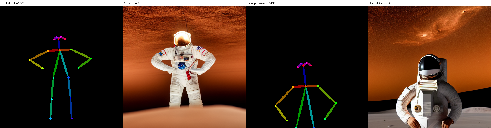
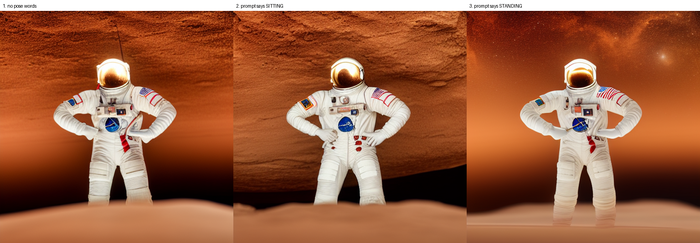
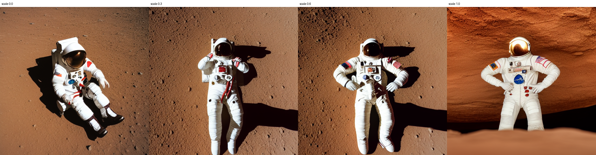

# 원하는 포즈로 이미지 만드는 도구

[](https://colab.research.google.com/github/nike1137-svg/pose-image-tool/blob/main/pose_tool.ipynb)

## 도구 설명

참조 사진에서 사람의 관절만 뽑아, 그 자세를 유지한 채 완전히 다른 인물·장면의 이미지를 만든다. 프롬프트로는 지정하기 어려운 "이 자세로"를 사진 한 장으로 지정하는 도구다.

```
참조 사진  →  OpenPose 스켈레톤  →  ControlNet  →  결과 이미지
           (자세만 남고 얼굴·옷·배경은 버려짐)   (내용은 프롬프트로 지정)
```

Google Colab 무료 T4에서 돌아간다. SD1.5 + `lllyasviel/control_v11p_sd15_openpose`, 512×512, 20스텝. 설치와 모델 다운로드에 5–8분, 이미지 한 장에 3–5초.

## 사용법

1. 위의 **Open In Colab** 배지를 누르면 노트가 열린다. 런타임을 **T4 GPU**로 설정한다.
2. **0번부터 11번 절까지** 위에서 아래로 실행한다. 4번 절에서 참조 사진을 올린다. 셀마다 첫 줄 주석에 그 셀이 하는 일이 적혀 있다.
3. 결과는 Colab 안의 `/content/out/` 에 쌓이고, 11번 절에서 zip으로 내려받는다. 이 저장소의 [`samples/`](samples) 에 그 결과를 넣어두었다.

12번 절 이후는 따라 하지 않아도 된다. 같은 도구로 더 파본 실험 기록이다.

참조 사진은 **전신이 보이고, 사람이 한 명이고, 팔이 몸에 붙지 않고 벌어진** 것을 쓴다.

## 재현 방법

시드를 난수로 뽑지 않고 조건 문자열에서 계산한다.

```python
seed = int(hashlib.sha256(f"{pose_id}|{prompt_id}|{scale}".encode()).hexdigest()[:16], 16) % 2**32
```

내장 `hash()` 는 프로세스마다 값이 달라져 재현이 깨지므로 쓰지 않았다. 노트 10번 절이 저장된 json의 시드를 규칙으로 다시 계산해 검증한다 — 8개 조합 전부 일치했다.

같은 이미지를 다시 만들려면 **참조 사진과 조건이 둘 다** 필요하다. 노트가 실제로 먹인 512×512 입력이 [`samples/pose_01.png`](samples/pose_01.png)·[`samples/pose_02.png`](samples/pose_02.png), 조건은 [`samples/metadata/`](samples/metadata) 의 json에 있다.

## 테스트 결과

- **포즈 1** (`pose_01.png`, 양손 허리) → 프롬프트: 화성 표면의 우주비행사 → 결과 `output_01.png`: **잘 됨.** 팔꿈치 각도, 손 위치, 다리 간격까지 일치
- **포즈 2** (`pose_02.png`, 양팔 만세) → **같은 프롬프트** → 결과 `output_02.png`: **잘 됨.** 팔이 올라갔다. 다만 손 모양은 시드마다 다르게 어색하다


같은 포즈에 프롬프트만 바꿨을 때(기사·수채화)는 자세가 유지되고 인물·옷·배경·화풍만 바뀌었다. 백발 남성 사진을 넣었는데 수채화 결과는 여성 인물이었고, 그런데도 양손 허리 자세는 그대로였다.


**프롬프트와 포즈, 어느 쪽이 결과를 더 크게 바꿨나** — 겉보기 변화는 프롬프트가 압도적이다. 인물·옷·배경·화풍이 전부 바뀐다. 자세는 프롬프트에 거의 흔들리지 않는다. 프롬프트에 `sitting cross-legged` 라고 자세를 지시해도 무시됐다. 둘이 담당하는 영역이 다르고, 같은 것을 지시하면 조건이 이긴다.

**잘 안 따라오는 것** — 손 모양과 얼굴 방향. 조건에 손가락 정보가 거의 없어서 시드마다 다르게 그려진다.

사용한 프롬프트 전문과 실험 설계는 [`prompts.md`](prompts.md) 에 있다.

## 한계

- **조건이 통제하는 것은 2D 좌표다.** 스켈레톤에 깊이가 없어서, 정면에서 본 서 있는 사람과 위에서 본 누운 사람의 관절 좌표가 거의 같다. 강도가 낮으면 모델이 조건을 어기지 않고 사람을 눕힐 수 있다.
- **프롬프트로는 자세를 바꿀 수 없다.** 자세를 바꾸려면 참조 사진을 바꿔야 한다.
- **전신이 안 보이면 그 부위만 조건에서 빠진다.** 상반신만 잘라도 검출은 되고 14/18이 잡힌다. 노트 5번 절의 실패 처리는 전부 검정인 경우만 걸러내므로 이런 부분 조건은 통과한다.
- **손은 조건에 넣을 수 있지만 품질이 참조 사진에 달렸다.** `include_hand=True` 로 손 관절을 넣을 수 있다. 다만 사진에서 손이 작으면 조건이 빈약해지고 손가락이 갈고리처럼 나온다. 충실한 손 조건이 손을 자연스럽게 만드는지는 확인하지 못했다.
- **FLUX.2-klein 4B를 쓰지 못했다.** klein 9B용 포즈 제어는 커뮤니티에 있지만 ComfyUI 커스텀 노드를 전제로 하고, 무료 T4에 올릴 크기가 아니다. SD1.5 + OpenPose ControlNet으로 대체했다.
- **512×512, SD1.5 기준이다.** `PRESET = "sdxl"` 로 바꾸면 1024px가 되지만 이미지당 60–90초로 늘어난다. 무료 T4는 시스템 RAM이 12.7GB뿐이라 SDXL 로딩이 아슬아슬하다.
- **포즈를 2종만 시험했다.** 시드는 5개까지 늘려봤지만 포즈는 늘리지 않았다. 포즈에 대한 결론은 `n=2` 다.
- **더 큰 모델에서도 같은지 확인하지 않았다.** 위 관찰은 `SD1.5 + control_v11p_sd15_openpose` 조합에서 얻은 것이다.

---

# 실험 기록

여기부터는 **과제가 요구한 범위 밖**이다. 같은 도구로 조건을 바꿔가며 세 번에 걸쳐 더 파봤고, 뒤로 갈수록 앞의 결론이 뒤집힌다.

| 차수 | 무엇을 했나 | 무엇이 바뀌었나 |
|---|---|---|
| 1차 | 포즈 2종 × 프롬프트 3종 + 강도 3단계, 총 8장. 자세 일치도를 숫자로 측정 | 절대 픽셀 거리는 자세가 아니라 구도를 재고 있었다 |
| 2차 | 조건을 끈 대조군 추가, 시드 고정, 시드만 바꿔 5장 | **1차 결론 다섯 개가 뒤집혔다** |
| 3차 | 관절 진단, 상반신만 조건, 프롬프트와 정면 충돌, 충돌+강도 4단계 | 조건은 자세가 아니라 2D 좌표를 통제한다 |

1차 기록은 지우지 않고 남겼다. 결과보다 틀렸다가 고친 과정이 남는 게 많아서다. 셀 단위 기록은 노트 12–14번 절에 있다.

## 논문·문서와 대조해보기

Colab 을 연습하다 재미가 붙어서 조건을 이리저리 바꿔봤다. 결과가 나온 뒤에 **혹시 이미 알려진 것인지 확인해봤고**, 대조해보니 대부분 문서에 있는 성질이었다.

| 우리가 관찰한 것 | 논문·문서에서는 | 출처 |
|---|---|---|
| 프롬프트와 충돌하면 조건이 이긴다 | ControlNet 논문이 프롬프트 설정을 네 가지로 나눠 시험하는데, 그중 하나가 **"조건의 의미와 충돌하는 프롬프트"** 다. 네 경우 모두 성공한다고 보고한다 | [arXiv 2302.05543](https://ar5iv.labs.arxiv.org/html/2302.05543) |
| 스켈레톤에 깊이가 없어 자세가 모호하다 | 같은 2D 좌표에 여러 3D 자세가 대응하는 것은 자세 추정의 기본 한계다. 후속 연구들이 3D 표현을 들여와 이걸 풀려고 한다 | [MagicPose](https://arxiv.org/pdf/2311.12052), [PoseMaster](https://arxiv.org/pdf/2506.21076) |
| 강도로 조건 반영 정도를 조절한다 | 공식 문서가 `controlnet_conditioning_scale` 을 바꿔 실험해 보라고 안내한다 | [Diffusers 문서](https://huggingface.co/docs/diffusers/using-diffusers/controlnet) |
| 조건 이미지가 구도까지 지시한다 | 구조 조건(canny·depth·pose)으로 기하와 위상을 고정하는 것이 ControlNet 의 설계 목적이다 | 위 논문 |
| 강도의 전환점이 둘이다 — 좌표가 먼저, 카메라가 나중 | 이 형태로 정리된 자료는 찾지 못했다 | — |
| 좌표만 재는 지표가 누운 사람을 "잘 됐다"로 판정한다 | 위 두 사실이 겹치는 지점이다. 우리 지표에 대한 관찰 | — |

그래서 아래 기록은 새로 알아낸 것 모음이 아니다. **문서에 있는 성질을 내 기계에서 확인하고, 그 과정에서 내 실험 설계의 결함을 찾아낸 기록**이다. 결함 쪽이 더 많이 남았다 — 대조군이 없었고, 두 값을 동시에 바꿨고, 한 장으로 규칙을 말했다.

읽은 것과 내 기계에서 본 것은 다르다. 다만 **"내가 처음 발견했다"와 "문서를 손으로 확인했다"도 다르다.**

## 1차 — 자세 일치도를 숫자로 재보기

비교 그림만으로는 "눈으로 봐서 같다"까지다. 그래서 생성된 이미지에 OpenPose를 다시 걸어 참조 사진의 관절과 얼마나 떨어졌는지 쟀다.

| 조건 | 공통 관절 | 절대오차 | 자세오차 | PCK@0.2 |
|---|---|---|---|---|
| pose01 + astronaut | 12 | 18.5px | 11.8% | 75% |
| pose01 + knight | 11 | 11.9px | 8.7% | 91% |
| pose01 + watercolor | 0 | – | – | 사람 검출 실패 |
| pose02 + astronaut | 0 | – | – | 사람 검출 실패 |
| scale 0.5 / 1.0 / 1.5 | 14 / 11 / 12 | 15.3 / 21.8 / 20.8px | 11.7 / 12.9 / 12.9% | 86 / 82 / **58%** |

**자세오차**는 목을 원점, 목–엉덩이중심 거리를 1로 맞춰 화면 내 위치·크기 차이를 지운 뒤 남은 관절 거리(그 거리 대비 %). **PCK@0.2**는 목–엉덩이중심 거리의 20% 안에 들어온 관절 비율. 노트에서는 이 값을 `몸통 길이` 로 줄여 부른다.

여기서 세 가지가 나왔다.

**절대 픽셀 오차는 자세 오차가 아니었다.** 강도 3단계의 절대오차는 43% 벌어졌지만 위치·크기를 맞추면 차이가 10%로 줄었다. 인물이 다른 크기·위치로 그려진 구도 차이였다. (뒤에서 이 판단도 절반만 맞았다는 게 드러난다.)

**측정 자체가 안 되는 경우가 있다.** 수채화와 역광 우주복은 OpenPose가 사람을 못 찾았다. 결과가 사실적이지 않을수록 자동 검증이 불가능해진다.

**강도를 올리면 PCK가 떨어졌다.** 86 → 58%. 여기서 "강도를 높이면 일부 관절이 망가진다"고 결론 냈는데, 2차에서 뒤집혔다.

## 2차 — 대조군과 시드 고정

1차 설계에 결함이 두 개 있었다.

**대조군이 없었다.** 조건을 켠 그림만 봤으니 "우주비행사는 원래 그렇게 서 있는 것 아닌가"에 답할 수 없었다.

**조건을 하나만 바꾸지 않았다.** 시드를 `sha256(pose|prompt_id|scale)` 로 계산했으므로 강도를 바꾸면 시드도 바뀌었다. 강도의 효과와 초기 잡음의 효과가 섞여 있었다.

### 조건을 껐다 켜기


조건을 끄면 등을 돌리고 팔을 내린 우주비행사가 나온다. 두 포즈 모두 `0.0` 쪽이 같은 그림이다 — 조건이 진짜 꺼졌다는 확인이다.

대조군이 한 일이 하나 더 있다. 자세오차 `11.8%` 가 좋은 값인지 알 방법이 없었는데, 조건을 끈 쪽은 `71.2%` 였다. **대조군은 지표의 눈금을 만들어준다.** 기준점 없는 숫자는 크기를 판단할 수 없다.

그리고 `pose02` 의 `1.0` 쪽은 팔이 곧게 V자로 올라갔고 장갑까지 그려졌다. 1차에서 "팔꿈치가 굽은 형태로 근사됐다", "손이 소실됐다"고 적은 것과 정반대다. 바꾼 것은 시드 하나뿐이다.

### 시드만 바꿔 네 장


네 장 모두 팔이 올라갔다. 고정 시드 한 장을 더하면 5장 중 5장이다. "극단적인 자세는 근사로만 반영된다"는 성립하지 않는다.

손은 네 장 다 그려졌지만 매번 다르게 어색했다. "손이 소실된다"가 아니라 "매번 다르게 그려진다"가 맞다.

> **시드를 여러 개 돌려서 매번 달라지는 부위를 찾으면, 그게 조건이 통제하지 못하는 곳이다.**
> 팔은 다섯 번 다 올라갔고, 손과 배경은 매번 달랐다. 한 장만 보면 알 수 없다. 변동성 자체가 정보다.

### 강도 실험 다시 — 시드 고정


| 강도 | 자세오차 | PCK@0.2 |
|---|---|---|
| 0.0 | 71.2% | 23% |
| 0.5 | 12.6% | 71% |
| 1.0 | 11.8% | 75% |
| 1.5 | **10.4%** | **92%** |

1차와 정반대다. 1차에서는 86 → 58%로 떨어졌던 PCK가 71 → 92%로 오른다. 같은 실험, 같은 지표, 같은 코드인데 시드를 고정했다는 것 하나가 달랐다. 1차 결과는 시드 잡음을 인과로 읽은 것이었다.

맞바꿈은 여전히 있고 자리가 다르다. 자세 정확도는 1.5까지 계속 좋아지는데, 그림으로는 0.5가 가장 좋다 — 별이 보이는 하늘, 배경 디테일이 살아 있다. 강도를 올리면 배경이 단순해지고 인물이 뻣뻣해진다. 그 대가는 관절 위치만 재는 지표에 잡히지 않는다.

### 1차 결론 정정

| 1차 | 실제 | 왜 틀렸나 |
|---|---|---|
| 극단적 자세는 근사로만 반영된다 | 5장 중 5장이 팔을 올렸다 | 한 장 보고 규칙을 말했다 |
| 손이 소실된다 | 매번 나오되 매번 다르게 어색하다 | 한 장 보고 규칙을 말했다 |
| 강도를 올려도 정확해지지 않는다 | 계속 좋아진다 (10.4%, 92%) | 강도와 시드를 동시에 바꿨다 |
| 전형 구도와 충돌해 포즈가 밀린다 | 조건을 끄니 등을 돌리고 있었다 | 확인 없이 설명을 붙였다 |
| 손은 조건에 넣을 수 없다 | `include_hand=True` 로 넣을 수 있다 | 옵션을 확인하지 않았다 |

## 3차 — 조건에 무엇이 담겨 있나

1·2차는 조건이 **얼마나 잘 지켜지는가**를 봤다. 3차는 조건 안에 **무엇이 들어 있는가**를 봤다.

### 조건은 프레이밍까지 지시한다



같은 사진의 상반신만 잘라 조건으로 넣었다. 하반신이 자유롭게 채워진 게 아니라 카메라가 가까이 들어왔다. 잘린 스켈레톤이 잘린 구도를 만들었다.

관절 진단을 붙여 보니 전신은 18/18, 상반신만 자른 것은 14/18(무릎·발목 누락)이었다. 14/18은 전부 검정이 아니므로 노트 5번 절의 실패 처리를 그냥 통과한다. **형식은 통과, 내용은 절반이다.**

여기서 1차의 판단 하나가 절반만 맞았다는 게 드러난다. 절대 픽셀 오차의 구도 차이를 "노이즈"라며 정규화로 지웠는데, 구도는 조건이 실제로 통제하는 축이었다.

### 프롬프트로는 자세를 못 바꾼다



가운데는 프롬프트에 `sitting cross-legged on the ground` 를 넣은 것이다. 앉지 않았다. 반대 방향만 보면 "원래 그렇게 나왔을 수도" 있으니 같은 방향(`standing with hands on hips`)도 함께 넣었는데 셋이 거의 같다.

### 강도는 "어디까지 따르나"를 정한다



프롬프트는 계속 "앉아라", 스켈레톤은 계속 "서라". 강도만 바꿨다.

| 강도 | 자세 | 카메라 | 조건이 가져온 범위 |
|---|---|---|---|
| 0.0 | 앉음 | 위에서 내려다봄 | 없음 — 프롬프트가 전부 |
| 0.3 | 누움 | 위에서 내려다봄 | 좌표를 느슨하게 |
| 0.6 | 누움 | 위에서 내려다봄 | 좌표를 정확히 |
| 1.0 | 서 있음 | 정면 | 좌표 + 그 좌표의 해석 |

전환점이 하나가 아니라 둘이었다. `0.3 → 0.6` 에서 관절의 2D 좌표가 넘어오고, `0.6 → 1.0` 에서 **그 좌표를 어느 방향에서 본 것으로 읽을지**가 넘어온다. 위에서 내려다본 구도는 프롬프트(`on the ground`)가 만든 것이었고, 강도가 충분해지자 조건이 카메라까지 빼앗아 왔다.

OpenPose 스켈레톤은 2D 이미지다. 깊이가 없다. 정면에서 본 서 있는 사람과 위에서 본 누운 사람은 관절의 2D 좌표가 거의 같다. 그래서 모델은 조건을 하나도 어기지 않고 사람을 눕힐 수 있었다.

`0.6` 이 그 증거다. 관절이 스켈레톤과 잘 맞으니 자세오차는 낮게 나온다. 그런데 사람은 누워 있다. **좌표만 재는 지표는 좌표가 무엇을 뜻하는지 모른다.**

## 남긴 숙제

- **손 조건을 충실하게 주면 손이 자연스러워지는가** — 참조 사진에서 손이 작아 확인하지 못했다. 검출 해상도를 올려봤지만 손가락은 늘지 않았고, 그 방법은 스켈레톤 선 두께까지 바꿔서 비교가 오염됐다. 손이 크고 선명한 사진이 필요하다.
- **포즈를 더 늘리면 같은 결론이 유지되는가** — 포즈 2종으로 얻은 결론이다.
- **"포즈가 그대로 반영됐는가"의 기준** — `0.6` 처럼 좌표는 맞고 방향은 다른 경우를 판정할 지표가 없다. 깊이나 방향을 재야 하는데 이 과제 범위를 넘어선다. 질문에 답한 것이 아니라 질문이 애매하다는 것을 밝혀낸 데까지다.
- **더 큰 모델에서도 같은지** — SDXL로 같은 충돌 실험을 하면 모델 축을 분리할 수 있지만, 무료 T4의 시스템 RAM(12.7GB)으로는 로딩이 아슬아슬해 하지 않았다.

## 만들면서 걸렸던 것

인터넷 예제 상당수가 2023년 코드라 저장소 ID가 낡아 있었다. 그대로 쓰면 모델 로드에서 404가 난다.

| 인터넷 예제 | 실제로 써야 하는 것 |
|---|---|
| `runwayml/stable-diffusion-v1-5` | `stable-diffusion-v1-5/stable-diffusion-v1-5` (2024년 8월 삭제) |
| `lllyasviel/sd-controlnet-openpose` | `lllyasviel/control_v11p_sd15_openpose` (ControlNet 1.1) |
| `OpenposeDetector.from_pretrained('lllyasviel/ControlNet')` | `...from_pretrained('lllyasviel/Annotators')` |

## 참조 사진 출처

`pose_01`, `pose_02` — [Pexels](https://www.pexels.com) (상업적 이용 허용, 출처 표기 의무 없음)

참조 사진의 얼굴·옷·배경은 결과에 전달되지 않고 관절 위치만 조건으로 쓰인다.
