# 원하는 포즈로 이미지 만드는 도구

[](https://colab.research.google.com/github/nike1137-svg/pose-image-tool/blob/main/pose_tool.ipynb)

## 도구 설명

참조 사진에서 사람의 **자세(관절)만** 뽑아내고, 그 자세를 유지한 채 완전히 다른 인물·장면의 이미지를 만드는 Colab 도구입니다. 프롬프트로는 지정하기 어려운 "이 자세로"를 사진 한 장으로 지정합니다.

```
참조 사진  →  OpenPose 스켈레톤  →  ControlNet  →  결과 이미지
           (자세만 남고 얼굴·옷·배경은 버려짐)   (내용은 프롬프트로 새로 지정)
```

| 항목 | 값 |
|---|---|
| 실행 환경 | Google Colab · 무료 T4 GPU |
| base model | `stable-diffusion-v1-5/stable-diffusion-v1-5` |
| 포즈 조건 | `lllyasviel/control_v11p_sd15_openpose` (ControlNet 1.1) |
| 포즈 추출 | `controlnet_aux` 의 OpenposeDetector (CPU 동작) |
| 해상도 / 스텝 | 512×512 / 20 steps |
| 소요 시간 | 설치·모델 다운로드 5–8분 + 이미지 1장당 3–5초 |

왼쪽이 참조 사진, 가운데가 뽑아낸 관절, 오른쪽이 만들어진 이미지다. 인물·옷·배경은 완전히 바뀌었지만 자세는 그대로다.

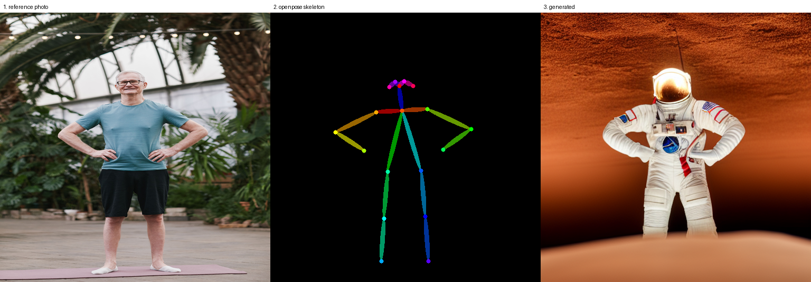

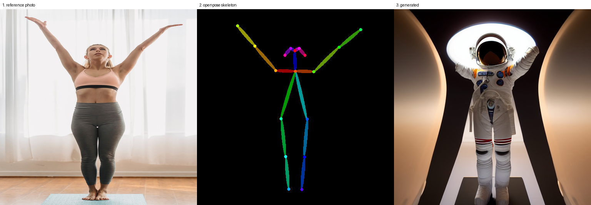

## 사용법

1. **Colab에서 노트 열기** — 위의 **Open In Colab** 배지를 누르면 바로 열립니다. 또는 [`pose_tool.ipynb`](pose_tool.ipynb) 를 내려받아 Colab에서 **파일 → 노트 업로드**로 올려도 됩니다. 런타임은 **T4 GPU**로 설정합니다.
2. **위에서 아래로 순서대로 실행** — 셀마다 첫 줄 주석에 그 셀이 하는 일이 적혀 있습니다.
   - `0–1` GPU 확인, 라이브러리 설치
   - `2–3` 조건 고정, 모델 로드 (한 번만)
   - `4–5` 참조 사진 업로드 → 관절 추출
   - `6–9` 이미지 생성, 조건 교차 테스트, 포즈 추종 강도 비교
   - `10–11` 재현 검증, 결과 zip 내려받기
   - `12` 포즈 일치도 정량 측정 (GPU 불필요, 단독 실행 가능)
3. **결과 저장 위치** — Colab 안에서는 `/content/out/` 에 쌓이고, 11번 셀을 실행하면 `pose_results.zip` 으로 내려받습니다. 이 저장소의 [`samples/`](samples) 에 그 결과 일부를 넣어두었습니다.

생성 1회마다 세 개의 파일이 남습니다.

| 파일 | 내용 |
|---|---|
| `{이름}.png` | 결과 이미지 |
| `{이름}.json` | 프롬프트 · 시드 · 시드 규칙 · 모델 · 스텝 · 강도 · 라이브러리 버전 |
| `{이름}_compare.png` | `참조 사진 \| 스켈레톤 \| 결과` 를 나란히 붙인 비교 그림 |

**참조 사진 조건**: 팔다리가 모두 보이는 **전신**, **한 명만**, 팔이 몸통에 붙어 있지 않은 자세. 얼굴 클로즈업이나 상반신만 있는 사진은 관절 검출에 실패합니다.

## 재현 방법

시드를 난수로 뽑지 않고 **조건 문자열에서 계산**합니다.

```python
seed = int(hashlib.sha256(f"{pose_id}|{prompt_id}|{scale}".encode()).hexdigest()[:16], 16) % 2**32
```

파이썬 내장 `hash()` 는 프로세스마다 값이 달라져 재현이 깨지므로 쓰지 않았습니다. 이 규칙 덕분에 런타임을 새로 켜도, 다른 사람이 이 노트를 돌려도 같은 조건은 같은 시드를 냅니다. 노트 10번 셀이 저장된 json의 시드를 규칙으로 다시 계산해 일치하는지 검증합니다.

같은 이미지를 다시 만들려면 **참조 사진과 조건이 둘 다** 필요합니다. json 하나만으로는 부족한데, 참조 사진이 없으면 스켈레톤이 달라지기 때문입니다. 그래서 노트가 실제로 먹인 512×512 입력을 [`samples/pose_01.png`](samples/pose_01.png), [`samples/pose_02.png`](samples/pose_02.png) 로 그대로 올려두었습니다. 이 두 장을 4번 셀에 업로드하고 `samples/metadata/` 의 json에 적힌 `prompt`, `prompt_id`, `control_scale` 을 넣으면 같은 이미지가 나옵니다.

## 테스트 결과

> ⚠️ **먼저 읽어주세요.** 이 절은 처음 실험한 기록이다. 그 뒤 [재실험](#재실험--대조군과-시드-고정)에서 대조군을 붙이고 시드를 고정해 다시 확인한 결과 **결론 네 개가 뒤집혔다.** 기록을 지우지 않고 남겨두었으니, 정정 내용은 재실험 절의 표를 함께 봐주세요.

포즈 2종 × 프롬프트 3종 + 강도 3단계, 총 8장을 생성했다. 실패한 조합은 없었다.

| 포즈 | 프롬프트 | seed | 결과 |
|---|---|---|---|
| pose01 (양손 허리) | astronaut | 340336256 | **잘 됨** — 팔꿈치 각도, 손 위치, 다리 간격까지 일치 |
| pose01 | knight | 3308244251 | **잘 됨** — 갑옷으로 실루엣이 두꺼워져도 자세 유지 |
| pose01 | watercolor | 3378889150 | **잘 됨** — 수채화 스타일에서도 자세 유지 |
| pose02 (양팔 만세) | astronaut | 1711213817 | **부분 반영** — 팔은 올라갔으나 팔꿈치가 굽고 손이 소실 |
| pose02 | knight | 3528176645 | **부분 반영** — 팔은 올라갔으나 갑옷 실루엣에 흡수됨 |

### 같은 포즈, 프롬프트만 바꿈 (pose_01)

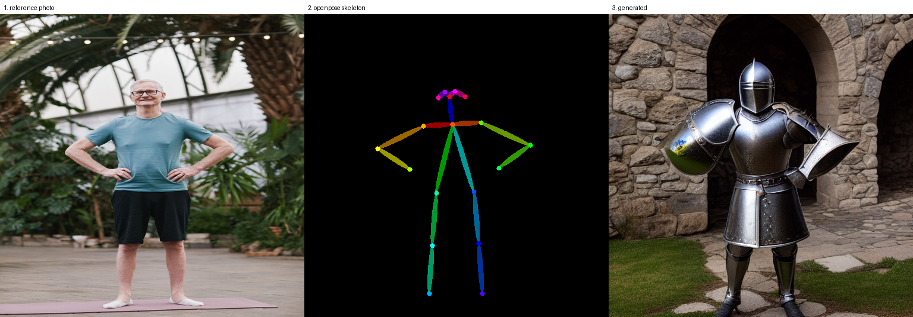

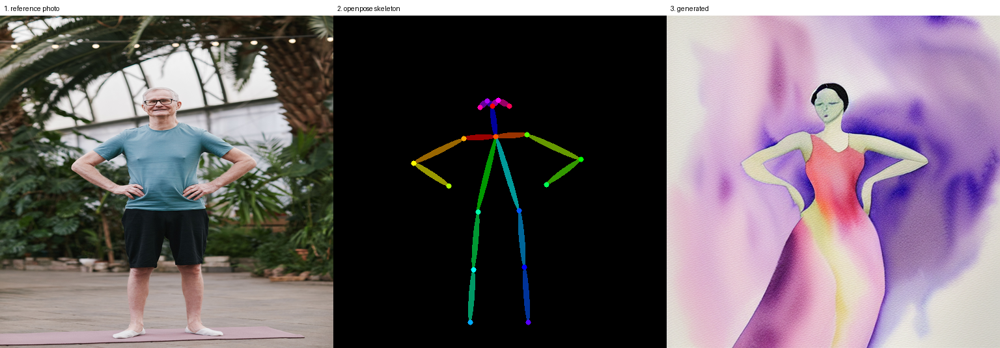

참조는 백발 **남성** 사진인데 수채화 결과는 **여성 인물**이다. 그런데도 양손 허리 자세는 유지됐다.

### 같은 프롬프트, 포즈만 바꿈

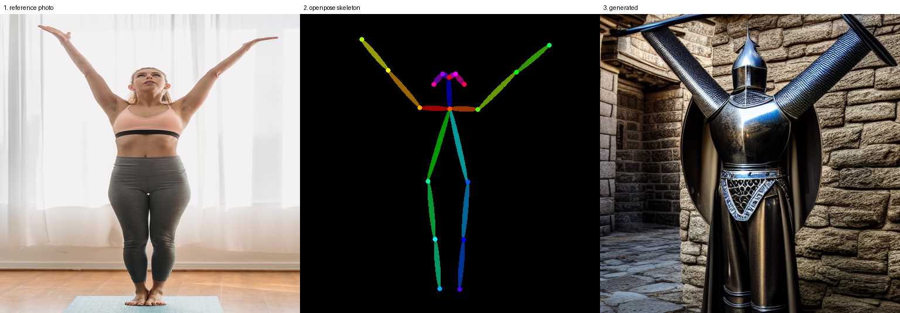

`pose_02`(양팔 만세) + knight. 팔은 올라갔지만 갑옷 실루엣에 흡수되어 형태가 뚜렷하지 않다. 같은 knight 프롬프트를 `pose_01` 에 넣은 위 그림과 비교하면 내용은 유지되고 자세만 바뀐 것을 볼 수 있다.

### 포즈 추종 강도만 바꿈 (pose_01 + astronaut 고정)

**0.5** — 팔이 몸통에 가까워지고 팔꿈치 벌어짐이 약해졌다

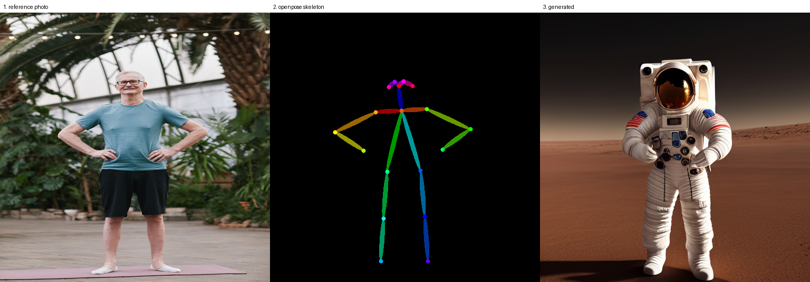

**1.0** — 스켈레톤과 가장 정확히 일치

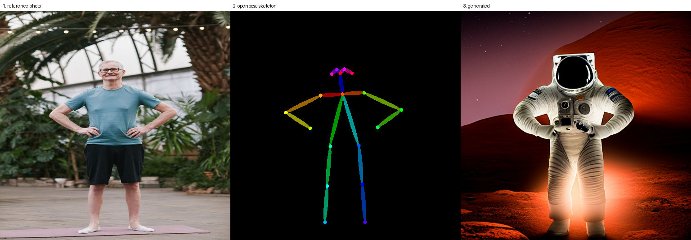

**1.5** — 자세는 정확하지만 인물이 뻣뻣해지고 배경이 원형 구조물로 단순화됨

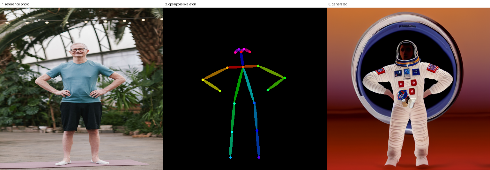

### 포즈 일치도 정량 측정

비교 그림만으로는 "눈으로 봐서 같다"까지다. 그래서 **생성된 이미지에 OpenPose를 다시 걸어** 참조 사진의 관절과 얼마나 떨어졌는지 쟀다 (노트 12번 셀, GPU 불필요).

| 조건 | 공통 관절 | 절대오차 | 자세오차 | PCK@0.2 | 판정 |
|---|---|---|---|---|---|
| pose01 + astronaut | 12 | 18.5px | 11.8% | 75% | 근사 |
| pose01 + knight | 11 | 11.9px | **8.7%** | **91%** | 일치 |
| pose01 + watercolor | 0 | – | – | – | 사람 검출 실패 |
| pose02 + astronaut | 0 | – | – | – | 사람 검출 실패 |
| pose01 astronaut, scale 0.5 | 14 | 15.3px | 11.7% | 86% | 근사 |
| pose01 astronaut, scale 1.0 | 11 | 21.8px | 12.9% | 82% | 근사 |
| pose01 astronaut, scale 1.5 | 12 | 20.8px | 12.9% | **58%** | 근사 |

측정 대상은 생성 이미지 8장 중 7장이다. `pose02 + knight` 는 측정 목록에 넣지 않아 빠졌다. 같은 pose02 계열인 astronaut 이 사람 검출에 실패한 것으로 보아 이쪽도 어려웠을 가능성이 크지만 확인하지는 않았다.

**자세오차** = 목을 원점, 목~엉덩이중심 거리를 1로 맞춰 화면 내 위치·크기 차이를 제거한 뒤 남은 관절 거리(몸통 길이 대비 %). **PCK@0.2** = 몸통 길이의 20% 안에 들어온 관절 비율. 판정은 자세오차 기준 10% 미만 일치 / 10–20% 근사 / 20% 이상 어긋남.

숫자가 말한 것 셋. **둘은 눈으로 본 관찰을 뒤집었다.**

1. **절대 픽셀 오차는 자세 오차가 아니었다.** 강도 3단계의 절대오차는 `15.3 → 21.8 → 20.8px` 로 43% 벌어졌지만, 위치·크기를 맞추면 `11.7 → 12.9 → 12.9%` 로 차이가 10%로 줄었다. 절대 거리의 상당 부분은 자세가 아니라 **인물이 다른 크기·위치로 그려진 구도 차이**였다.
2. **강도를 올려도 자세가 정확해지지 않는다.** 자세오차는 0.5와 1.5가 사실상 같다. 대신 PCK가 `86% → 58%` 로 떨어졌다. 평균은 그대로인데 **크게 어긋난 관절의 비율이 늘어난 것**이다. 강도를 높이는 건 자세를 정확하게 만드는 게 아니라 일부 관절을 망가뜨리며 그림을 경직시킨다. 1.5가 뻣뻣해 보였던 것과 일치한다.
3. **측정 자체가 안 되는 경우가 있다.** 수채화와 역광 우주복은 OpenPose가 사람을 못 찾았다. **결과가 사실적이지 않을수록 자동 검증이 불가능해진다.** 정작 "근사됐다"고 관찰한 pose02를 숫자로 확인하지 못했고, 그 항목은 여전히 눈으로 본 것이 유일한 근거다.

가장 잘 맞은 것은 `knight`(8.7%, PCK 91%)였다. 갑옷의 딱딱하고 뚜렷한 실루엣이 오히려 관절 추정에 유리했던 것으로 보인다.

## 재실험 — 대조군과 시드 고정

처음 실험을 마친 뒤 다시 돌려보면서 **설계에 두 가지 결함**을 찾았다.

**하나. 대조군이 없었다.** 포즈 조건을 켜고 만든 그림만 봤으니, 그 자세가 정말 조건 때문인지 증명이 안 됐다. "우주비행사는 원래 그렇게 서 있는 것 아닌가"에 답할 수 없었다.

**둘. 조건을 하나만 바꾸지 않았다.** 시드를 `sha256(pose|prompt_id|scale)` 로 계산했으므로 강도를 바꾸면 시드도 같이 바뀌었다. 강도 실험은 강도의 효과와 초기 잡음의 효과가 섞여 있었다.

### 대조군 — 조건을 껐다 켜기

시드·프롬프트·스텝을 전부 고정하고 `controlnet_conditioning_scale` 만 `0.0` / `1.0` 으로 바꿨다.

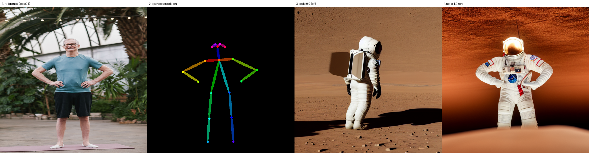

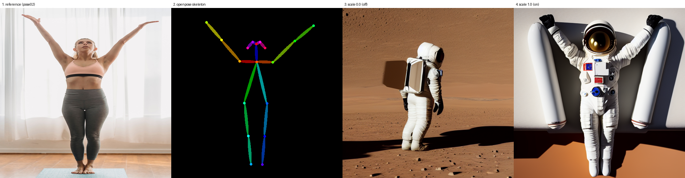

조건을 끄면 **등을 돌리고 팔을 내린** 우주비행사가 나온다. 두 포즈 모두 `0.0` 쪽이 같은 그림이다 — 조건이 진짜 꺼졌다는 확인이다. 이제 "포즈가 반영됐다"에 근거가 있다.

대조군이 한 일이 하나 더 있다. 앞에서 자세오차 `11.8%` 를 보고 "근사"라고 판정했지만 그게 좋은 값인지 알 방법이 없었다. 조건을 끈 쪽은 `71.2%` 였다. **대조군은 지표의 눈금을 만들어준다.**

그리고 `pose02` 의 `1.0` 쪽은 팔이 **곧게 V자로** 올라갔고 장갑까지 그려졌다. "만세는 팔꿈치가 굽은 형태로 근사됐다", "손이 소실됐다"고 적었던 것과 정반대다. 바꾼 것은 시드 하나뿐이다.

### 시드만 바꿔 네 장 — 한 장으로 규칙을 말할 수 없다

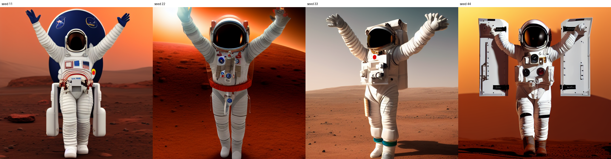

네 장 모두 팔이 올라갔다. 고정 시드 한 장을 더하면 **5장 중 5장**이다. "극단적인 자세는 근사로만 반영된다"는 성립하지 않는다.

손은 네 장 다 그려졌지만 매번 다르게 어색했다. 그래서 "손이 소실된다"가 아니라 **"매번 다르게 그려진다"** 가 맞다.

여기서 진단 방법이 나온다.

> **시드를 여러 개 돌려서 매번 달라지는 부위를 찾으면, 그게 조건이 통제하지 못하는 곳이다.**
> 팔은 다섯 번 다 올라갔다 → 조건이 잡고 있다. 손과 배경은 매번 달랐다 → 조건 밖이다.
> 한 장만 보면 알 수 없다. **변동성 자체가 정보다.**

### 강도 실험 다시 — 이번엔 시드 고정

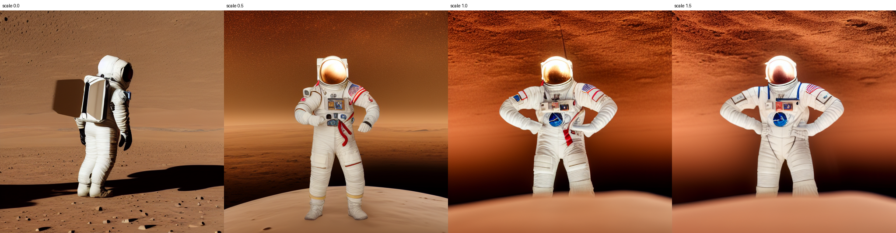

| 강도 | 공통 관절 | 자세오차 | 합격률(PCK@0.2) |
|---|---|---|---|
| 0.0 | 13 | **71.2%** | 23% |
| 0.5 | 14 | 12.6% | 71% |
| 1.0 | 12 | 11.8% | 75% |
| 1.5 | 12 | **10.4%** | **92%** |

처음 실험과 정반대다.

| 강도 | 처음 (시드 안 고정) | 재실험 (시드 고정) |
|---|---|---|
| 0.5 | 11.7% / 86% | 12.6% / 71% |
| 1.0 | 12.9% / 82% | 11.8% / 75% |
| 1.5 | 12.9% / **58%** | 10.4% / **92%** |

처음에는 강도를 올리면 합격률이 86 → 58로 떨어졌다. 시드를 고정하면 71 → 92로 오른다. 같은 실험, 같은 지표인데 결론이 뒤집혔다. **처음 결과는 시드 잡음을 인과로 읽은 것이었다.**

다만 맞바꿈은 여전히 있고 자리가 다르다. 자세 정확도는 1.5까지 계속 좋아지는데, **그림으로는 0.5가 가장 좋다** — 별이 보이는 하늘, 배경 디테일이 살아 있다. 강도를 올리면 배경이 단순해지고 인물이 뻣뻣해진다. 그 대가는 관절 위치만 재는 지표에 잡히지 않는다.

정리하면 **자세 정확도를 사려면 그림의 자유도를 지불한다.**

### 손 조건 — 켤 수 있었다, 그리고 미결

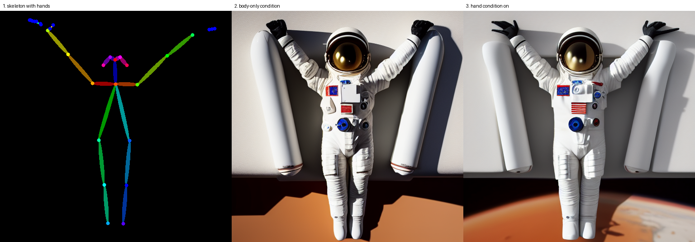

`include_hand=True` 로 손 관절도 조건에 넣을 수 있다. 앞에서 "OpenPose body 모델은 손가락을 다루지 않으므로 통제할 수 없다"고 적었는데 **도구의 한계가 아니라 켜지 않은 옵션이었다.**

효과도 있었다. 손가락이 갈라져 나왔다 — 몸통만 조건에서 벙어리장갑처럼 뭉쳐 있던 것과 다르다. 대신 갈고리처럼 어색해졌다. 강도 실험과 같은 맞바꿈이다.

**"손 조건을 충실하게 주면 손이 자연스러워지는가"는 확인하지 못했다.** 스켈레톤의 손 쪽이 손목 끝 선 두세 개로 빈약하고 한쪽은 팔 끝에서 어긋나 있다. 참조 사진에서 손이 작게 찍혀서다. 검출 해상도를 1024로 올려봤지만 손가락은 늘지 않았고, 그 방법은 선 두께까지 같이 바꿔서 비교가 오염됐다. **손이 크고 선명한 참조 사진이 필요하다. 억지로 결론을 붙이지 않고 미확인으로 남긴다.**

### 정정 정리

| 처음 결론 | 실제 | 왜 틀렸나 |
|---|---|---|
| 극단적인 자세는 근사로만 반영된다 | 5장 중 5장이 팔을 올렸다 | 한 장 보고 규칙을 말했다 |
| 손이 소실된다 | 매번 나오되 매번 다르게 어색하다 | 한 장 보고 규칙을 말했다 |
| 강도를 올려도 정확해지지 않는다 | 계속 좋아진다 (10.4%, 92%) | 시드가 강도마다 달라 두 효과가 섞였다 |
| 전형 구도(정면 직립)와 충돌해 밀렸다 | 조건을 끄니 등을 돌리고 있었다 | 확인 없이 그럴듯한 설명을 붙였다 |
| 손은 조건에 넣을 수 없다 | `include_hand=True` 로 넣을 수 있다 | 옵션을 확인하지 않았다 |

원인은 세 가지로 정리된다. **한 장만 봤거나, 두 개를 동시에 바꿨거나, 대조군이 없었다.**

살아남은 결론은 두 개다.

- **참조 사진에서 관절만 넘어간다** — 백발 남성 사진으로 수채화 속 여성이 나왔는데 자세는 그대로였다. 대조군에서 조건을 끄니 자세가 완전히 달라진 것으로 다시 확인됐다.
- **조건과 자연스러움은 맞바꿈이다** — 자리가 다르다. 자세 정확도는 강도를 올릴수록 좋아지고, 대가는 배경·디테일의 자유도로 나타난다.

**관찰**

- **같은 포즈 + 프롬프트만 바꿨을 때** — 세 장 모두 자세가 유지됐다. `watercolor` 가 가장 분명한 증거였다. 참조 사진은 백발 **남성**인데 결과는 수채화로 그린 **여성 인물**이고, 그런데도 양손 허리 자세는 그대로다. 참조 사진에서 성별·나이·옷·배경은 전달되지 않고 **관절 위치만** 넘어간다는 뜻이다.
- **같은 프롬프트 + 포즈만 바꿨을 때** — 자세가 바뀐 것은 확인됐지만, 만세 포즈는 팔을 곧게 뻗은 V자가 아니라 팔꿈치가 약 90도로 굽은 형태로 근사됐다. 같은 도구·같은 강도인데 pose01은 정확히, pose02는 근사로만 따라왔다. **포즈 종류에 따라 추종 정확도가 다르다** — 다만 이 항목은 pose02의 정량 측정이 검출 실패로 불가능해 눈으로 본 것이 유일한 근거다.
- **어느 쪽이 결과를 더 크게 바꿨나** — 겉모습은 프롬프트가, 구조는 포즈가 바꿨다. 두 조건의 역할이 분리되어 서로 간섭하지 않았다. 다만 자세가 극단적일수록 프롬프트가 가진 전형 구도(우주비행사·기사는 정면 직립)와 충돌해 포즈 쪽이 밀렸다. **흔한 자세일수록 잘 따라오고, 드문 자세일수록 근사된다.**
- **잘 따라오지 않은 부분** — 손, 팔을 완전히 뻗은 각도, 얼굴 방향.

**포즈 추종 강도(control scale)** — pose01 + astronaut 고정, 강도만 변경

| 강도 | 눈으로 본 것 | 측정값 (자세오차 / PCK@0.2) |
|---|---|---|
| 0.5 | 팔이 몸통에 가까워지고 팔꿈치 벌어짐이 약해졌다 | 11.7% / 86% |
| 1.0 | 스켈레톤과 가장 잘 맞아 보였다 | 12.9% / 82% |
| 1.5 | 인물이 좌우대칭으로 뻣뻣해지고 배경이 원형 구조물로 단순화됐다 | 12.9% / **58%** |

**눈과 숫자가 어긋났다.** 보기에는 1.0이 가장 정확했는데 측정은 0.5를 가장 낮은 오차로 냈다. 다만 세 값의 차이가 1.2%p뿐이라 순위 자체에 의미를 두기는 어렵다. 확실한 신호는 **1.5에서 PCK가 58%로 급락한 것** — 강도를 올리면 평균 오차가 아니라 크게 어긋나는 관절의 수가 늘어난다.

사용한 프롬프트 전문과 실험 설계는 [`prompts.md`](prompts.md) 에 정리했습니다.

## 한계

- **FLUX.2-klein-4B로는 만들지 못했다.** 이 도구는 강의에서 쓴 FLUX.2-klein-4B(GGUF Q4) 데모에서 출발했다. 조사해 보니 klein **9B**용 포즈 제어는 커뮤니티에 존재하지만(Civitai의 depth/openpose 워크플로, `refcontrol` 포즈 LoRA, `MatchingPose` LoRA 등) 전부 9B 기준이고 ComfyUI 커스텀 노드를 전제로 한다. 무료 T4 16GB에서 4B Q4도 이미지 1장에 33초가 걸렸으므로 9B + ControlNet은 실행이 어렵다. 그래서 같은 목적을 달성할 수 있는 SD1.5 + OpenPose ControlNet으로 대체했다.
- **전신이 보이지 않는 사진은 쓸 수 없다.** OpenPose가 관절을 못 찾으면 스켈레톤이 전부 검정이 되고, 그 상태로 생성하면 포즈가 반영되지 않은 이미지가 "성공"으로 기록된다. 에러가 아니라 조용한 오염이라 로그만 봐서는 알 수 없다. 그래서 5번 셀에서 검정 이미지를 미리 걸러 실패로 처리했다.
- **손은 조건에 넣을 수 있지만 품질이 참조 사진에 달려 있다.** 처음에는 "손은 조건에 포함되지 않아 통제할 수 없다"고 적었는데 사실이 아니었다. `include_hand=True` 로 넣을 수 있다. 다만 참조 사진에서 손이 작게 찍히면 조건이 빈약해지고, 그 빈약한 조건을 따라 손가락이 갈고리처럼 나온다. **충실한 손 조건이 손을 자연스럽게 만드는지는 미확인으로 남겼다.**
- **표정과 얼굴 방향은 여전히 통제 밖이다.** `include_face` 옵션이 있지만 시험하지 않았다.
- **~~극단적인 자세는 근사로만 반영된다~~ — 재실험에서 뒤집혔다.** 시드만 바꿔 다섯 장을 만들어보니 다섯 장 모두 팔이 올라갔다. 처음에 본 굽은 팔은 그 시드 하나의 결과였다. 자세히는 위 [재실험](#재실험--대조군과-시드-고정) 절에 있다.
- **512×512 해상도.** 무료 GPU 시간을 아끼려 SD1.5를 기본으로 썼다. `PRESET = "sdxl"` 로 바꾸면 1024px가 되지만 이미지당 60–90초로 늘어난다.
- **같은 시드라도 라이브러리 버전이 바뀌면 결과가 달라질 수 있다.** 그래서 json에 `torch` / `diffusers` / `transformers` 버전을 함께 기록했다.
- **정량 검증이 사실적인 이미지에만 동작한다.** 7건 중 2건(수채화, 역광 우주복)은 OpenPose가 생성 이미지에서 사람을 찾지 못해 측정 자체가 불가능했다. 자동 검증은 결과가 사실적일 때만 쓸 수 있다.
- **비교한 관절 수가 11~14개로 케이스마다 다르다.** 18개 중 양쪽 모두 검출된 것만 쓰므로 표본이 작고, 어느 관절이 빠졌는지에 따라 수치가 흔들릴 수 있다.
- **첫 측정 방법은 틀렸다.** 절대 픽셀 거리만 재면 인물이 조금 작게 그려지거나 옆으로 밀린 것까지 자세 오차로 잡힌다. 목을 원점으로 몸통 길이를 1로 정규화한 뒤에야 자세 모양만 비교됐다. 교정 전후 수치를 위 표에 함께 남겼다.

- **처음 실험에는 대조군이 없었다.** 조건을 켠 그림만 보고 결론을 냈다. 조건을 끈 그림을 만들고 나서야 근거가 생겼고, 자세오차를 읽을 눈금(조건 끔 = 71.2%)도 같이 생겼다. **기준점 없는 숫자는 크기를 판단할 수 없다.**
- **시드 규칙이 강도를 삼키고 있었다.** `sha256(pose|prompt_id|scale)` 이라 강도를 바꾸면 시드도 바뀐다. 조합마다 재현은 되지만 **조합끼리 비교하는 실험에는 쓸 수 없는 설계**였다.
- **한 장으로 규칙을 말했다.** 결론 두 개가 이 때문에 뒤집혔다. 같은 조건에서 시드만 바꿔 여러 장을 보면 어느 부위가 조건에 잡혀 있고 어느 부위가 자유로운지 드러난다.

## 만들면서 걸렸던 것

인터넷 예제(HuggingFace 공식 블로그 포함)를 참고했는데 상당수가 2023년 코드라 저장소 ID가 낡아 있었다. 그대로 쓰면 모델 로드 셀에서 바로 404가 난다.

| 인터넷 예제 | 실제로 써야 하는 것 |
|---|---|
| `runwayml/stable-diffusion-v1-5` | `stable-diffusion-v1-5/stable-diffusion-v1-5` (Runway가 2024년 8월 저장소 삭제) |
| `lllyasviel/sd-controlnet-openpose` | `lllyasviel/control_v11p_sd15_openpose` (ControlNet 1.1) |
| `OpenposeDetector.from_pretrained('lllyasviel/ControlNet')` | `...from_pretrained('lllyasviel/Annotators')` |

## 참조 사진 출처

- `pose01`, `pose02` — [Pexels](https://www.pexels.com) (상업적 이용 허용, 출처 표기 의무 없음)

참조 사진의 얼굴·옷·배경은 결과에 전달되지 않고 관절 위치만 조건으로 쓰인다.
